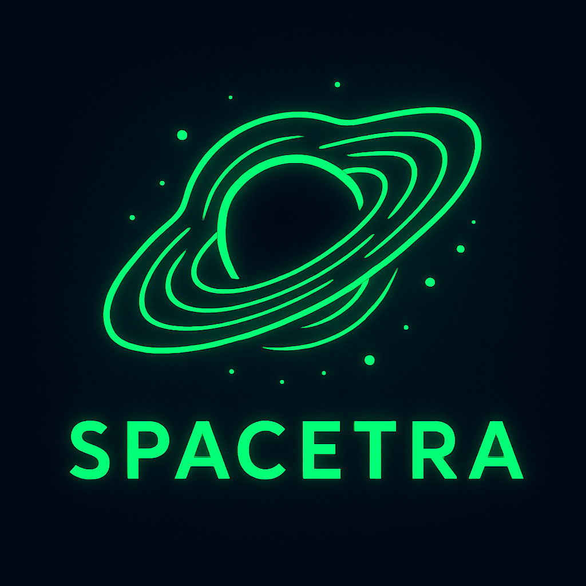

# Spacetra-logo
# 🌌 SPACETRA

**SPACETRA** is a futuristic and creative project exploring the intersection of design, space, and technology. Whether it's branding, animation, or digital experiences, SPACETRA represents innovation beyond the stars.

---

## 🚀 About This Project

SPACETRA is more than just a logo — it's a vision of cosmic creativity. This repository contains the visual assets, concept story, and future updates of the SPACETRA branding project.

### 🔮 Features

- Glowing, futuristic space-themed branding
- Minimalistic yet dynamic design
- Scalable for various digital and print use
- Ideal for tech, sci-fi, and creative industries

---

## 🛠️ Tech Stack / Tools

- **Design Software**: Adobe Illustrator / Figma / Photoshop  
- **File Format**: PNG (high-res), SVG (coming soon)  
- **Color Palette**: Neon Green on Deep Space Blue  
